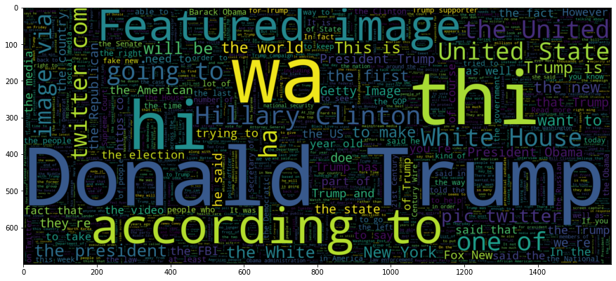

# Gutenberg: A Fake News Classifier

Hello! Have you ever wondered if what you're reading is fake news? Lets find out with Machine Learning!
I constructed a Recurrent Neural Network using **TensorFlow & Keras** which attempts to classify a news story stored in a URL link. My model has achieved an accuracy of 99.45% thanks in part by utilizing GloVe word vectors and a long short-term memory (LSTM) learning architecture.

    
## How was the model trained?

The model was trained using a Kaggle Data set of 40,000+ news articles comprising of fake and real news articles.

**https://www.kaggle.com/clmentbisaillon/fake-and-real-news-dataset**

## Dependencies

1. **Python 3.7.7**
2. **TensorFlow 1.14**
3. **Newspaper3K**
4. **Seaborn**
5. **NLTK**
6. **Wordclouds**

## Project Structure

1. **read_data.ipynb:** Loads, labels, and merges Kaggle dataset.
2. **analyze_data.ipynb:** Perform preliminary analysis of training dataset (Interesting observations).
3. **clean_data.ipynb:**  Cleans dataset before pre-processing step.
4. **preprocess_data.ipynb:** Splits and embeds text training and test data for training step.
5. **LSTM.ipynb:** Fits LSTM model over training data. Evaluates model's performance.
6. **input:** Stores training dataset, tokenizer and GloVe word vectors.
7. **save_models:** Stores trained LSTM models
8. **app:** Contains Flask App that will serve trained model.

**IMPORTANT: If you're having issues loading the Jupyter notebook in GitHub, copy the http link of notebook and paste in https://nbviewer.jupyter.org/**

Have Fun!

